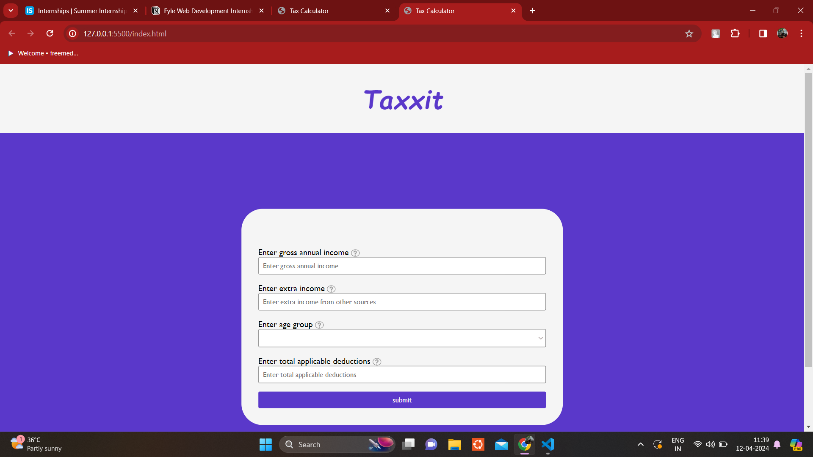
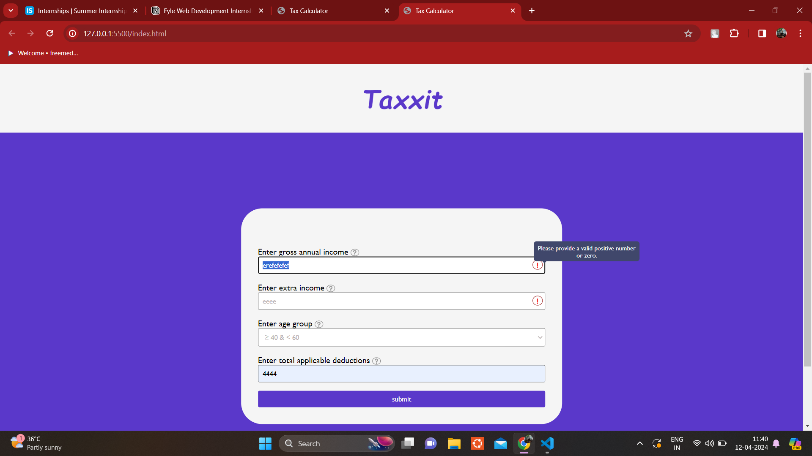
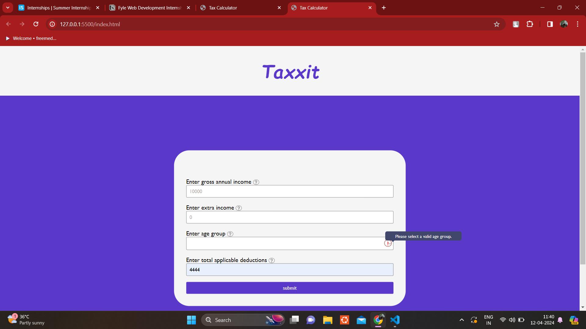
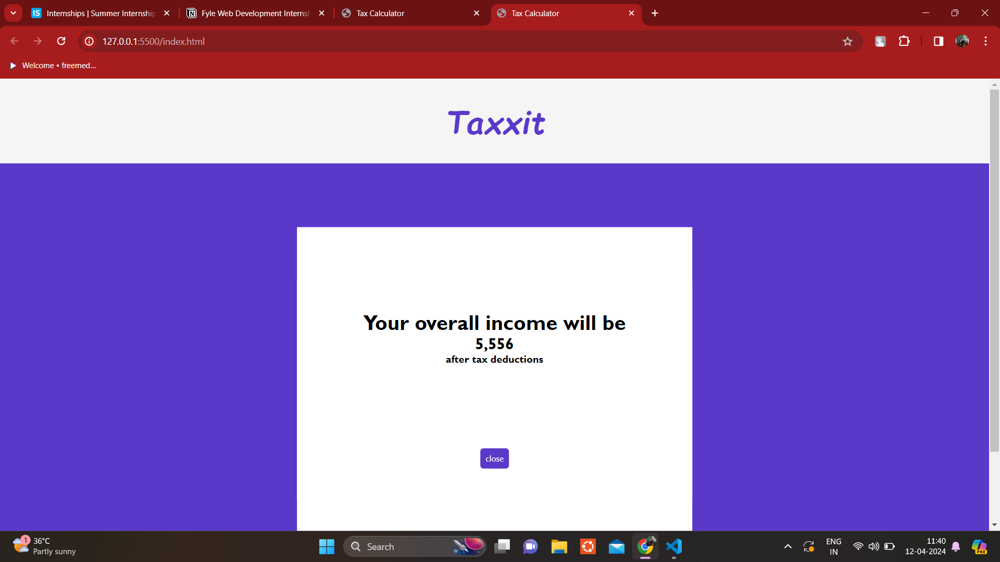
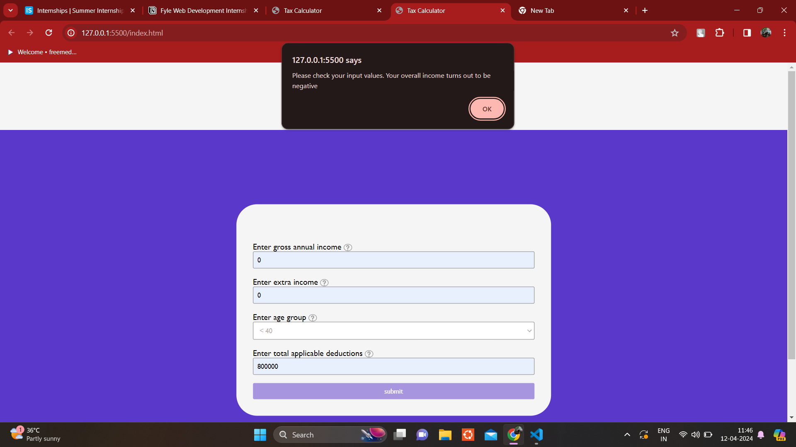

# TAX CALCULATOR

This application allows tax calculation based on the user inputs. The user is expected to enter Gross annual income, Extra income from other sources, Applicable deductions (if any) and Their age group. Incase of invalid user inputs the application highlights some errors to the users.

## Design

The User interface of the application is built using HTML, CSS and javaScript.

## Test Cases

#### Error icons

The application shows Error icon in the input field where there is an invalid input. If we hover over the error icon, it shows appropriate error message.

#### Result page

If all the inputs given by the user passes the validation check, the user can view their overall income after deduction of tax in a modal component.

#### Alert message

Incase the user enters amount which after tax calculation results in a negative value, an alert message will be sent to the webpage to warn the users that the inputs needs to be checked again.

## View Deployment

https://lovely-dasik-a37609.netlify.app/
